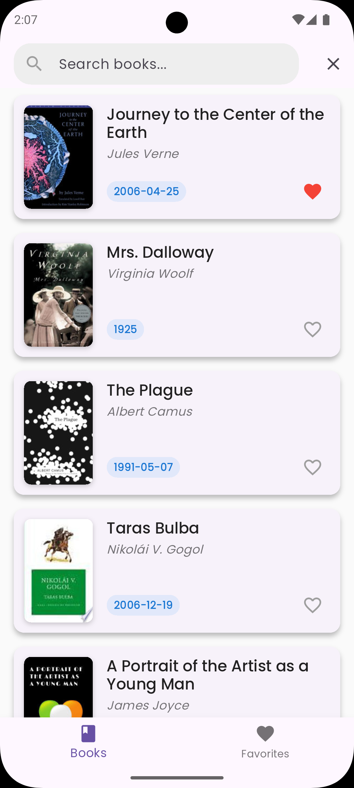

# BookBuddy

A Book Discovery and Management Application

## Project Demo

<br/> <div style="text-align: center;"></div>

[Download App Demo APK](https://drive.google.com/file/d/1EwGYxHfWpLnIL0mt_WBS0GWjrVwJIDda/view?usp=sharing)

## Features

- Google Books API integration
- Display book list with infinite scroll pagination
- Detailed book information view
- Pull-to-refresh functionality
- App flavors for different environments
- BLoC state management
- Favorite book list management
- Search functionality

## Project Structure

The project follows a clean architecture pattern with a well-defined directory structure:

- **lib**: The main source code directory.
    - **core**: Contains common utilities, configurations, and constants.
    - **data**: Responsible for data handling (data sources, models, repositories).
    - **domain**: Contains the core business logic (entities, repositories, use cases).
    - **presentation**: Handles the user interface and interaction (BLoC, pages, widgets).
    - **di**: Dependency injection setup.

## Getting Started

1. Clone this repository:
   ```shell
   git clone https://github.com/risfat/book_buddy
   ```

2. Navigate to the project directory:
   ```shell
   cd book_buddy
   ```

3. Install dependencies:
   ```shell
   flutter pub get
   ```

4. Set up your Google Books API key:
    - Create a `.env` file in the project root
    - Add your API key: `GOOGLE_BOOKS_API_KEY=your_api_key_here`

5. Run the app:
   ```shell
   flutter run --flavor development -t lib/main_development.dart
   ```

## Flavor Setup

This project uses flavor configurations for different environments:

- Development
- Staging
- Production

To run the app with a specific flavor:

```shell
flutter run --flavor <flavor_name> -t lib/main_<flavor_name>.dart
```

The flavor configuration is set up in `lib/core/config/flavor_config.dart`.

## State Management

This project uses the BLoC (Business Logic Component) pattern for state management. BLoC separates the presentation layer from the business logic, making the code more maintainable and testable.

Key BLoC files can be found in `lib/presentation/bloc/`.

## Contributing

Contributions are welcome! Please feel free to submit issues or pull requests.

Happy coding! 🚀